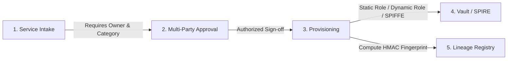

# Credential Lifecycle Laboratory - User & Testing Guide

This guide explains how to use the **Control Plane Web UI**, how secrets and services are created and registered in the single source of truth, and how you can run hands-on tests yourself.

---

## 1. Web UI Overview

The lab includes a reference control plane Web UI running on:
👉 **[http://localhost:8000](http://localhost:8000)** (or `http://127.0.0.1:8000`)

### What the UI Displays
1. **Active Incidents & Containment Panel:** Shows all detected leaks, correlation status, containment status (`verified`, `pending`, `failed`), recovery status, and case lifecycle (`open`, `closed`).
2. **Authoritative Services Registry Panel:** Lists all registered services, their accountable owner groups, application categories (`legacy`, `integrated`, `spiffe`, `unmodifiable`), and revision counters.
3. **Service Intake & Approval Form:** Allows draft submission of new services with required ownership, classification, and restart behaviors.
4. **Metrics & Verification Freshness Panel:** Live metrics including:
   - Intake completeness rate (%)
   - Owner resolution coverage (%)
   - Scanner coverage & missing scans
   - Verified containments count
   - Median MTTC (Time to Containment) and MTTR (Time to Recovery)

---

## 2. The Lifecycle: How Secrets & Services Are Created

In this laboratory, secrets are never created in isolation or pasted into a plain key-value store. They follow the **Intake $\rightarrow$ Approval $\rightarrow$ Managed Provisioning** lifecycle:



### Step 1: Submit an Intake Request
Every secret must be tied to a service. You submit an intake specifying:
- **Service Name & Stable ID** (`svc-my-service`)
- **Accountable Owner Group** (`core_platform`)
- **Application Category:** `legacy` (static file at startup), `integrated` (dynamic lease pool), or `spiffe` (mTLS identity)
- **Classification & Criticality:** `restricted`, `high`
- **Replacement Mode & Restart Behavior:** `restart`, `graceful_exit`

**CLI Example:**
```bash
curl -X POST http://127.0.0.1:8000/api/intakes \
  -H "Content-Type: application/json" \
  -H "X-Requester-Id: alice" \
  -d '{
    "service_id": "svc-billing-api",
    "service_name": "Billing API Engine",
    "owner_group": "billing_team",
    "operational_contact": "billing-ops@lab.local",
    "fallback_group": "security_fallback",
    "environment": "production",
    "classification": "restricted",
    "business_criticality": "high",
    "application_category": "integrated",
    "target_resource": "postgres:5432/appdb",
    "requested_permissions": ["read", "write"],
    "consumer_list": ["billing-worker"],
    "lifetime_policy": "1h",
    "replacement_mode": "pool_reload",
    "expected_restart_behavior": "graceful_exit",
    "recovery_procedure_id": "proc-billing-01"
  }'
```
*(Returns an intake object with an `id`, e.g. `intake-a1b2c3` and `status: "draft"`)*

---

### Step 2: Approve the Intake (Separation of Duties)
Per [REQ009](file:///Users/llody/code-base/secret_exposure/poc/REQUIREMENTS.md#L37), **the requester cannot approve their own intake**. An authorized approver (e.g. `owner_dave`) must approve it:

```bash
curl -X POST http://127.0.0.1:8000/api/intakes/intake-a1b2c3/approve \
  -H "Content-Type: application/json" \
  -H "X-Actor-Id: owner_dave" \
  -d '{
    "approver_id": "owner_dave",
    "expected_revision": 1
  }'
```

---

### Step 3: Managed Provisioning (Vault & Fingerprint Registration)
Once approved, the intake is provisioned into the authoritative registry.
- Creates the Vault role / target permissions.
- Computes an **HMAC fingerprint** of the credential version and stores it in `credential_versions`.
- **Never exposes or stores the raw secret material in the database.**

```bash
curl -X POST http://127.0.0.1:8000/api/intakes/intake-a1b2c3/provision
```
*(Returns `{"status": "provisioned", "service_id": "svc-billing-api", "current_version_id": "v1-xxx"}`)*

---

## 3. Hands-On Self-Testing Workflows

You can test each scenario individually using the provided Makefile targets or curl commands:

### Scenario A: Legacy App Rotation (Vault Static Role + Supervisor)
In this scenario, a legacy application reads credentials only from `/secrets/db-creds.json` at startup. When a leak occurs, Vault coordinates the database password change and the process supervisor restarts the consumer without downtime or stale sessions:

```bash
# Run the automated demonstration
make demo-legacy
```

**Manual Test Step-by-Step:**
1. **Trigger a synthetic leak:** Register an HMAC fingerprint or simulate a scanner finding:
   ```bash
   curl -X POST http://127.0.0.1:8000/api/findings \
     -H "Content-Type: application/json" \
     -d '{
       "event_id": "evt-leak-001",
       "source": "gitleaks",
       "detected_at": "2026-09-06T12:00:00Z",
       "locator": "repos/billing/config.py:12",
       "claimed_service_hint": "svc-legacy",
       "detector_identity": "gitleaks-scanner",
       "detector_version": "8.24.0"
     }'
   ```
2. **Check the Web UI:** Notice the incident appears in [http://localhost:8000](http://localhost:8000) assigned to `owner_dave`.
3. **Approve Rotation:**
   ```bash
   curl -X POST http://127.0.0.1:8000/api/incidents/<incident_id>/decisions \
     -H "Content-Type: application/json" \
     -d '{
       "actor": "owner_dave",
       "action": "rotate",
       "reason": "Secret exposed in public commit",
       "expected_revision": 1
     }'
   ```
4. **Execute Operation:**
   ```bash
   curl -X POST http://127.0.0.1:8000/api/operations/<operation_id>/execute \
     -H "Content-Type: application/json" \
     -d '{"execution_identity": "secops_runner"}'
   ```
5. **Verify:** Check `http://127.0.0.1:8001/query`—the legacy application is reconnected with the new password, and supervisor tracked interruption in milliseconds.

---

### Scenario B: Dynamic Leases & Session Termination
In this scenario, dynamic short-lived PostgreSQL credentials are held by the integrated app. When compromised, new issuance is blocked, the lease is revoked in Vault, and active database backend sessions are terminated:

```bash
make demo-integrated
```

**Manual Verification:**
1. Check current dynamic lease:
   ```bash
   curl http://127.0.0.1:8002/db_query
   ```
2. Test proactive lease renewal:
   ```bash
   curl -X POST http://127.0.0.1:8002/renew
   ```
3. Test seamless pool replacement:
   ```bash
   curl -X POST http://127.0.0.1:8002/replace
   ```

---

### Scenario C: Zero-Secret SPIFFE mTLS & Dynamic Policy Isolation
In this scenario, workloads communicate via mutual TLS without passwords, using SPIRE-issued X.509 SVIDs. When a workload is suspected compromised, its SPIFFE ID is isolated at the target service policy:

```bash
make demo-identity
```

**Manual Verification:**
1. Inspect caller's SVID (cryptographic non-secret metadata):
   ```bash
   curl http://127.0.0.1:8003/svid_info
   ```
2. Call protected service:
   ```bash
   curl http://127.0.0.1:8003/call
   # Output: {"status":"authorized","peer_spiffe_id":"spiffe://lab.local/workload/caller"}
   ```
3. Dynamically deny caller on protected service:
   ```bash
   curl -X POST http://127.0.0.1:8444/admin/policy \
     -H "Content-Type: application/json" \
     -d '{"allowed_spiffe_ids": []}'
   ```
4. Call again:
   ```bash
   curl http://127.0.0.1:8003/call
   # Output: HTTP 403 Forbidden! Immediate target containment without restarting containers.
   ```

---

## 4. Enterprise Portal & CI/CD Pipeline Workflow

### Scenario D: Enterprise Intake with Automated Vault Provisioning
1. Open the UI at [http://localhost:8000](http://localhost:8000).
2. Fill in the **Enterprise Secret Intake & Vault Registration** form:
   - **Service ID**: e.g., `svc-payment-gateway`
   - **Service Name**: Payment Gateway API
   - **Owner Group**: `finance_secops`
   - **Network Exposure**: `external_facing`
   - **Data Classification**: `PII` or `PCI-DSS`
   - **Initial Secret Value**: Enter the secret token or password.
   - **Auto-Rotation Support**: Toggle `Yes` or `No` (for legacy apps, set to `No` to stage a secondary credential slot).
3. Click **Submit Intake Request**.
4. The system automatically:
   - Registers service in the authoritative registry.
   - Writes secret to Vault KV at `secret/data/{service_id}/config`.
   - Creates a Vault AppRole `{service_id}-approle` with ACL policy `{service_id}-read-policy`.
   - Generates RoleID and SecretID for application consumption.

---

### Scenario E: GitLab CI/CD Secret Detection, CMDB Lookup & Approval
1. In the **GitLab CI/CD Pipeline Simulator** panel:
   - Select the target repository/service (e.g., `svc-legacy`).
   - Check **Simulate Secret Leak in Commit Diff** to inject a simulated commit containing the secret.
   - Click **Push Commit to GitLab**.
2. **Pipeline Execution & Gate**:
   - `build` stage passes.
   - `secret-detect` stage scans the diff using Gitleaks and blocks (`failed_blocked`).
   - `deploy` stage is blocked (`blocked_gated`).
3. **Automated CMDB/Ticketing Correlation**:
   - System correlates the leaked secret against the Authoritative Registry.
   - Identifies the application (`svc-legacy`), Owner (`legacy_team`), Exposure (`internal_facing`), and Data Sensitivity (`PII`).
   - Automatically opens an Incident Ticket with correlation evidence.
4. **Approval for Revocation**:
   - Click **Approve Revocation & Unblock** in the UI.
   - System revokes the exposed credential, updates the state to `mitigated_rotated`, and unblocks the deployment pipeline (`passed`).

---

### Scenario F: Legacy Zero-Downtime Hot-Swap
For legacy applications that cannot integrate natively with HashiCorp Vault:
1. When auto-rotation is disabled, the sidecar wrapper manages a dual-credential slot (Primary & Secondary).
2. Trigger the credential switch via the sidecar wrapper:
   ```bash
   curl -X POST http://127.0.0.1:8001/control/swap_credential \
     -H "Content-Type: application/json" \
     -d '{"new_password": "NewProductionPassword2026!"}'
   ```
3. The wrapper verifies the new credentials against the database target *prior* to switching.
4. Memory pointers and `/secrets/db-creds.json` on tmpfs are atomically updated with 0ms downtime.

---

## 5. Running the Full Automated Acceptance Suite

To run all 26 core scenarios (A01 through A26) and generate an audit evidence package:

```bash
make test
```

To export the resulting evidence:
```bash
make evidence
```
This produces the following in `poc/evidence/<run_id>/`:
- `manifest.json`: Run metadata, platform, timestamps, and pass/fail summary.
- `report.md`: Markdown report detailing every scenario.
- `assertions.json`: Complete assertion trace with inputs, outputs, and status.
- `events.jsonl`: Cryptographically stamped audit events with component versions (`Vault 1.18.5`, `SPIRE 1.11.2`, `PostgreSQL 17.11`, `Gitleaks 8.24.0`).
